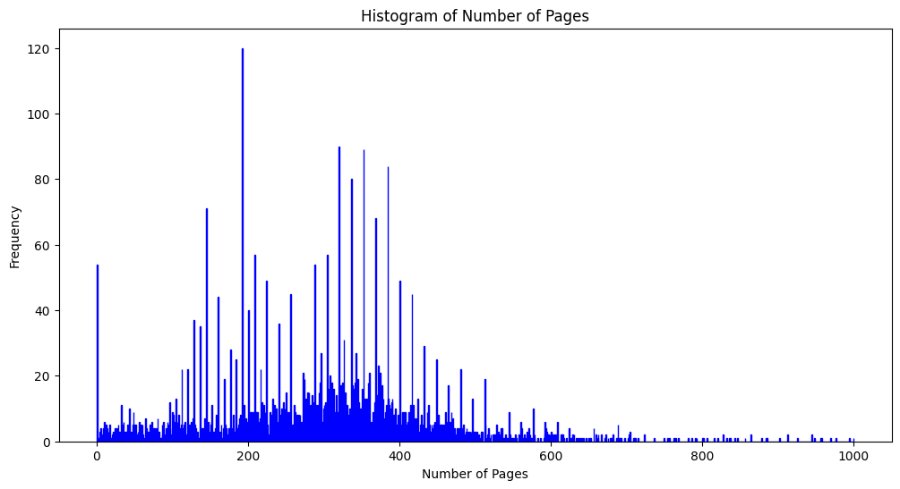
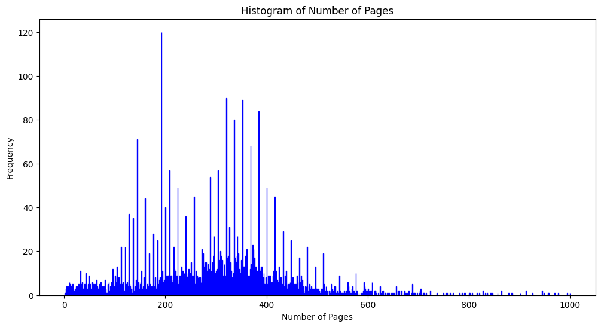
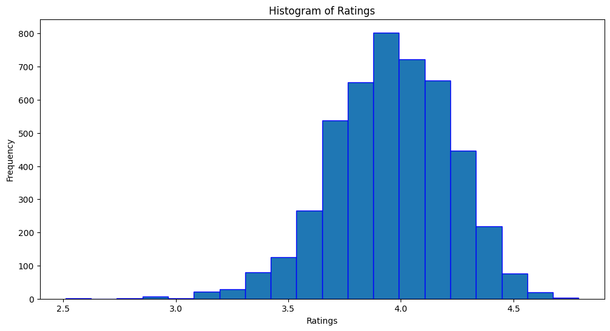
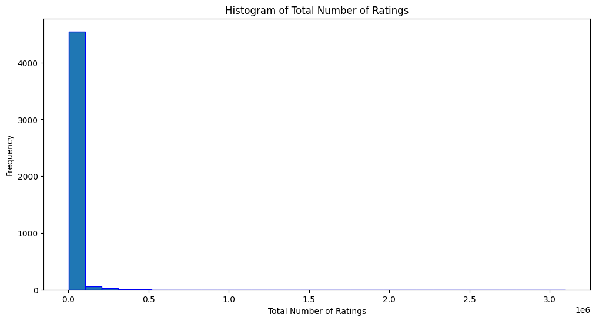
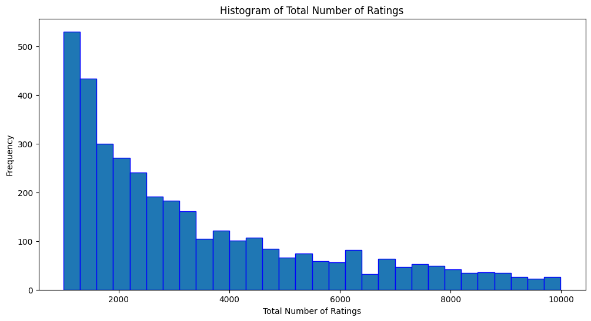
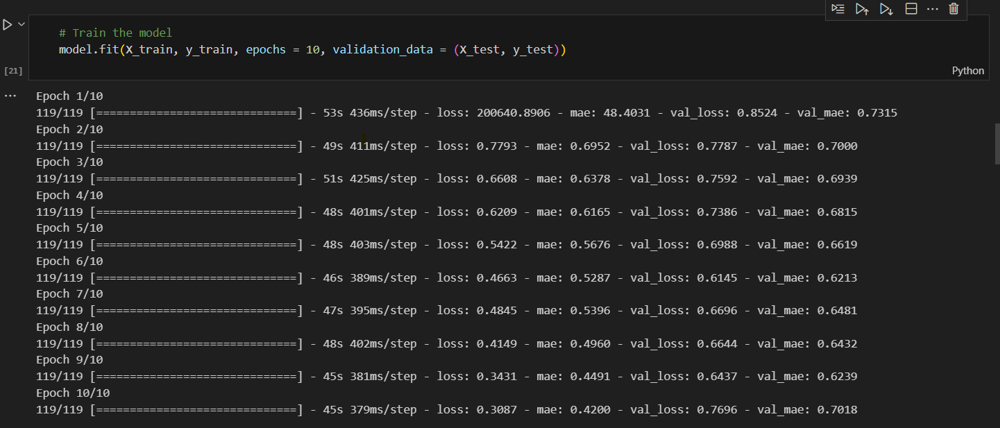
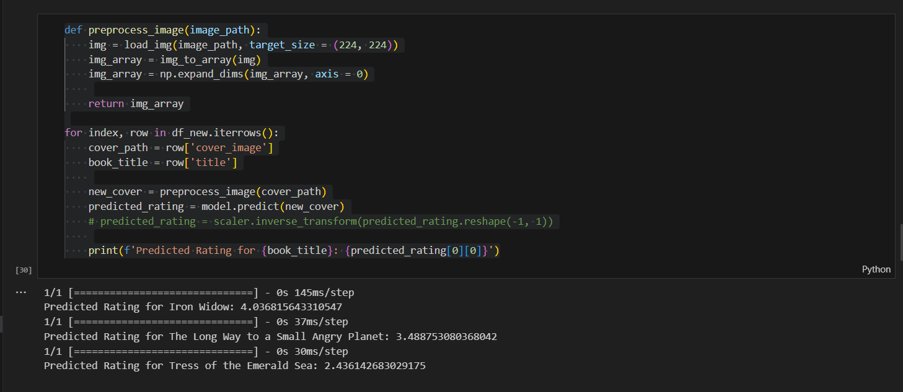
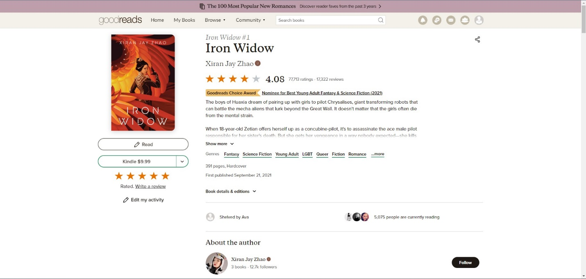

[Back to Project Page](https://kdfullington.github.io/kdfullington_portfolio/projects/)

[Visit the Repository for This Project](https://github.com/kdfullington/kdfullington-portfolio/tree/main/predicting_book_ratings)

**Business Problem**
Many book publishing companies would like to know what kind of traits in books lead to higher average ratings, and therefore to increased book sales. They have a great deal of control over both book cover and blurb (the description on the back of the book that gives a summary that is supposed to capture the attention of someone browsing a bookstore), so they want to know if there are certain characteristics of covers and/or blurbs that might influence rating.

**Background**
Goodreads.com is a website that catalogues published books of all formats. It allows users to add books to personalized shelves, give star ratings, and write reviews, among other functions. The data used here has been collected from Goodreads.com and stored in a dataset on Kaggle.com.

**Data Explanation**
The original data set contained 100,000 records. To get a data set of a more reasonable scale for the question I want to answer, I narrowed down the genres only to sci-fi and fantasy. This reduced the number of records to 4724 records.
Here are the variables that were included with the original data set:

| Variable      | Description                                                                                                      |
|---------------|------------------------------------------------------------------------------------------------------------------|
| Author        | A text value containing the name of the author                                                                   |
| Bookformat    | The format of the book (e-book, mass market, hardback, etc.)                                                     |
| Desc          | A text value that usually contains the cover blurb (book description found on the back of most physical books), or other summary of the book’s content |
| Img           | An HTTPS link to the image of the cover                                                                         |
| Isbn          | A standard unique number identifying the book                                                                   |
| Isbn13        | A standard unique number identifying the book that contains 13 characters                                      |
| Link          | A link to the Goodreads.com page containing the book                                                            |
| Pages         | An integer describing the number of pages in a book                                                             |
| Rating        | A float (0-5) containing the average of all user ratings that existed at the time the data set was collected     |
| Reviews       | An integer representing how many reviews a book had at the time the data set was collected                       |
| Title         | A text value containing the title of the book                                                                   |
| Totalratings  | An integer reflecting the number of individual ratings a book had at the time the data set was collected         |
| Genre         | A string of genres that could apply to the book separated by commas                                             |

**Methods**
For this project, I decided to focus on two methods for predicting the average rating for each book. 
First, a convolutions neural network (CNN). CNNs are a type of model that specializes in image classification and other image-related tasks. The idea is to imitate the visual cortex in animals, responding to visual regions. They operate by sliding a filter over the input data and finding patterns. This includes anything from textures to object representation. Something called a loss function measures the accuracy of the model. The fitted CNN model can then be used to predict new data. In this case, I will be using it to predict book ratings.
Second, I used Natural Language Processing (NLP) to fit a linear regression model to the data. NLP helps to translate text data into numerical data that is more easily interpreted by computers.

**Data Cleaniing**
To clean the data, I first reduced the number of records to make for easier processing. I dropped any records that had null values for the ‘img’ column, which decreased the number of records from 100,000 to 96,955. Next, I split out the “genre” variable on the commas into multiple columns with the prefix “genre_”. I then gradually limited down the books to records that contained science fiction and/or fantasy for the genre entries. This reduced the number of records to 10,586.
There were some entries that contained book descriptions (in the “desc” column) that were in languages other than English. I created a function to detect the language of in that column and removed all but those that were in English. Then I tokenized the language for that column, in case I wanted to use that column to help predict book ratings. The number of records was reduced to 9,676.
Next, I checked statistics for the number of pages using the describe function in Python. Given that the third quartile was at 350, I decided to remove records that had greater than 1000 pages. I checked the same for reviews and total number of ratings. I removed all books that had fewer than 1000 ratings to increase the reliability of the average rating.
Then, I validated that the “img” column only contained one link for each record. Following that, I created a function to request the images based on the link in the “img” column, standardize them, and assign them to a training data set.

**Exploratory Data Analysis**
When exploring the data and before modeling, I decided to drop all the genre columns to simplify the data set. I also realized that there were records that contained zero for the number of pages. 

Looking at the chart, I realized that there were way too many books with zero pages, so I dropped the records that had 0 pages. Here is the new visualization:

I also checked the distribution of ratings. We can see that most records contained ratings between 3.5 and 4.5 stars. 

Next, I checked the column containing the total number of ratings for each book. 

We can see that some books received an astronomical number of ratings, leading to drastically right-skewed data. I checked the statistics of this attribute with the describe function.

| Statistic | Value       |
|-----------|-------------|
| Count     | 4,669       |
| Mean      | 17,560.01   |
| Std       | 99,121.69   |
| Min       | 1,001       |
| 25%       | 1,801       |
| 50%       | 3,463       |
| 75%       | 8,645       |
| Max       | 3,099,689   |

The third quartile was at 8645, while the maximum value was over 3,000,000. I decided to limit the number of ratings to be less than 10,000 ratings to get rid of outliers.

| Statistic | Value        |
|-----------|--------------|
| Count     | 3,627.000000 |
| Mean      | 3,356.915633 |
| Std       | 2,246.904169 |
| Min       | 1,001.000000 |
| 25%       | 1,559.000000 |
| 50%       | 2,569.000000 |
| 75%       | 4,518.000000 |
| Max       | 9,989.000000 |

The new distribution of ratings was much more legible and reasonable.
The total number of records was now reduced to 3627.

**Data Preparation**
When exploring the data and before modeling, I decided to drop all the genre columns to simplify the data set. I also removed records with 0 pages based on what I found during exploratory data analysis, and limited the records to those with less than 10,000 reviews. I also dropped the Title, Link, ISBN, ISBN13, IMG, DESC, and Author columns. At some point in the future, I would like to explore the description column more, but for now I am removing it to simplify analysis. 
I decided that I wanted to create columns with numerical representations and color histograms for the cover images. I created functions to do both those, flattened the resulting numerical and histogram columns, then dropped the Cover Image column that contained the JPEGs. I also created dummy columns out of the book format column, and changed the column label type to string. Lastly, I wrote the resulting data frame to a new CSV file. 

**Analysis**
The CNN model proved to be relatively high-performing, with both loss and mean absolute error (MAE) decreasing over time. This indicates that the model learned with each successive layer, and was reasonably successful at predicting the target variable (book rating). 

To test the performance of the model, I entered three new books into the program. I took screenshots of the present scores on Goodreads.com and compared the predictions to the actual scores. I chose three books that were in the sci-fi/fantasy genres because the data my model was trained on contained primarily those genres.

Actual Ratings at Time of Project:

| Title                                   | Predicted Rating | Actual Rating |
|-----------------------------------------|-------------------|---------------|
| Iron Widow                              | 4.04              | 4.08          |
| The Long Way to a Small, Angry Planet   | 3.5               | 4.18          |
| Tress of the Emerald Sea                | 2.43              | 4.45          |

The prediction for Iron Widow was almost spot-on, while the predictions for the other two books were a fair bit further from the mark. In the future, I would like to create some visualizations to determine what traits the model focused on when making predictions. 

The NLP model had a low mean squared error (MSE) of 0.05. Given that the target variable was 0-5, that is a decent margin. I decided to check what the most important words were to determining the predictions of the model, and the results were interesting.

For high positive ratings, the most important words were as follows.

| Feature      | Coefficient (Level of Correlation) |
|--------------|------------------------------------|
| Share        | 1.198828                           |
| Warrior      | 0.755163                           |
| Luffy        | 0.744516                           |
| Sakura       | 0.606792                           |
| Morganville  | 0.579293                           |
| Meanwhile    | 0.557274                           |
| Wonderland   | 0.503053                           |
| Abel         | 0.498316                           |

I was immediately alerted that something went wrong in my data cleaning. I happen to know that “Luffy” is the main character of a Manga (Japanese comic book) series called One Piece. What this means is that I did not successfully eliminate all manga and graphic novels from my list. One Piece is a very highly rated series, and as one of the longest running Mangas of all time, it likely has a high number of entries on Goodreads.com for the numerous different volumes. In the future, I will need to pay closer attention to data cleaning.

Next, I entered the descriptions of the same three books I used in the CNN model into this model to get its predictions. Here are the results.

| Title                                   | Predicted Rating | Actual Rating |
|-----------------------------------------|-------------------|---------------|
| Iron Widow                              | 3.81              | 4.08          |
| The Long Way to a Small, Angry Planet   | 3.70              | 4.18          |
| Tress of the Emerald Sea                | 3.85              | 4.45          |

The NLP model was overall less accurate in predicting ratings for new books than the CNN model. So, it could be assumed that book covers are better predictors of book rating than book descriptions. 

**Conclusion**
After performing analysis of two types of models (CNN and NLP), it seems that book covers are better predictors of book ratings than book descriptions. Book marketers and publishing companies could focus on cover design (and to a lesser extent, descriptions) as a way to impact ratings. 

**Assumptions**
For the purposes of this project, I assumed that the data was accurate at the time it was collected. Sometimes Goodreads can be misused and people will spam reviews on books they particularly like or dislike. I also assumed that the data cleaning and preparation I implemented produced an accurately limited set of just science fiction and fantasy books.

**Limitations**
The processing power of my local machine was a big limitation on this project. With just text and numeral data for 100,000 records, it would likely not have been as challenging. However, when I attempted to process cover images, I had to drastically reduce that number to have enough processing power to complete the function loop. Having more time would also have been beneficial, providing more opportunity for feature engineering.

**Challenges**
Processing so many images proved to be an issue. I needed to create space on my local drive to store the processed images for later use. Increasing storage or available memory would be ideal for this project in the future.

**Future Uses and Additional Applications**
In the future, it would be ideal to see if it is possible to process all 100,000 images to increase the sample data. 
The CNN model could be used to identify what characteristics of book covers have the highest impact on book rating. The NLP model could, after refining the training data, be used to determine how best to describe a book to encourage higher ratings.

**Recommendations**
Both models could be run again on cleaner and more intentional data. Visualizations would help determine more details about why the CNN model predicts what it does.

**Implementation Plan**
New data frames can be created with new book data and run through both models to ascertain how effective they are.

**Ethical Assessment**
The data used in this project was free to access from the Goodreads website, and all data was public. There was also no personal information contained in this data set. So ultimately, the ethical risks of this project were very low. 