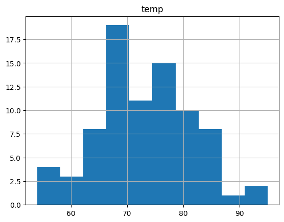
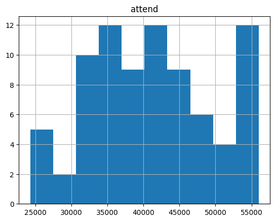
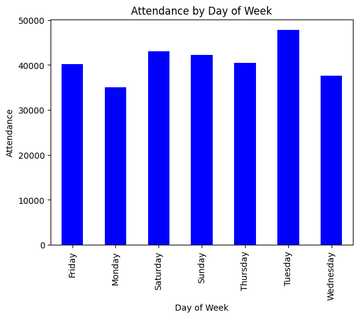
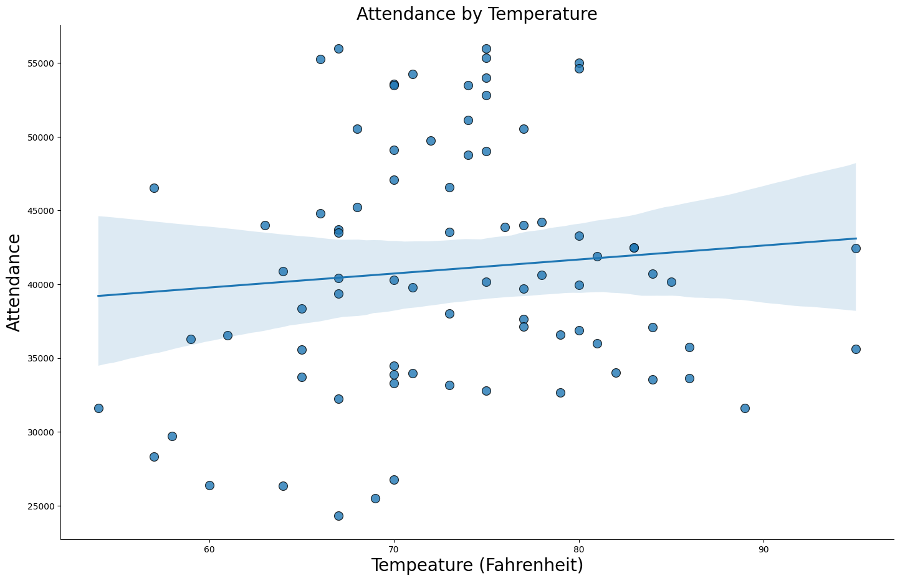
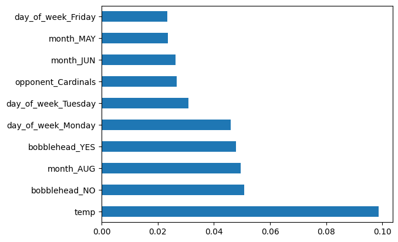

[Back to Project Page](https://kdfullington.github.io/kdfullington_portfolio/projects/)

[Visit the Repository for This Project](https://github.com/kdfullington/kdfullington-portfolio/tree/main/dodgers_games_attendance)

For this project I attempted to identify what features most impacted attendance and make a recommendation as to how the team can increase game attendance.

A histogram of temperature distribution.

A histogram of attendance distribution.

A bar chart of the average attendance based on day of the week. 

A scatter plot with line of best fit for attendance as relates to temperature.

A graph indicating relative feature importance. We can see that temperature is the most influential feature in game attendance.

