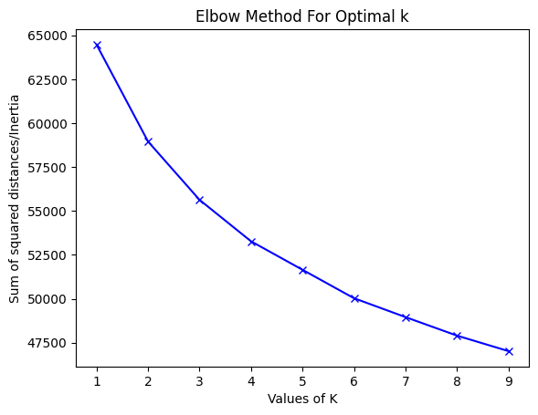
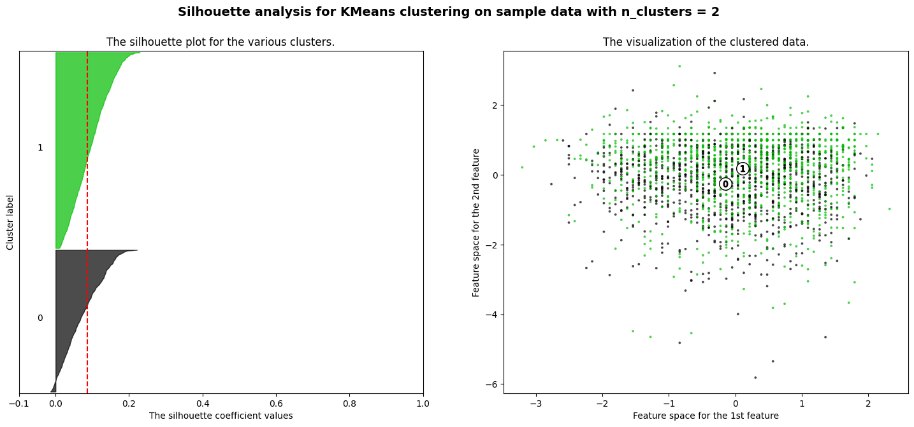
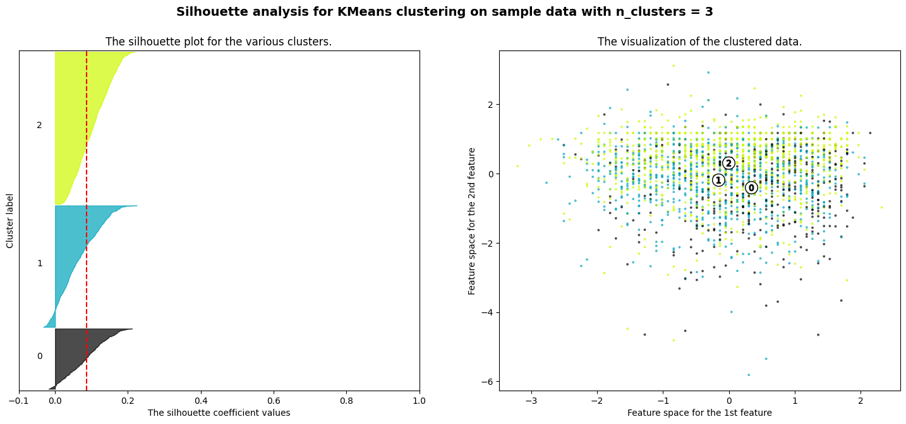
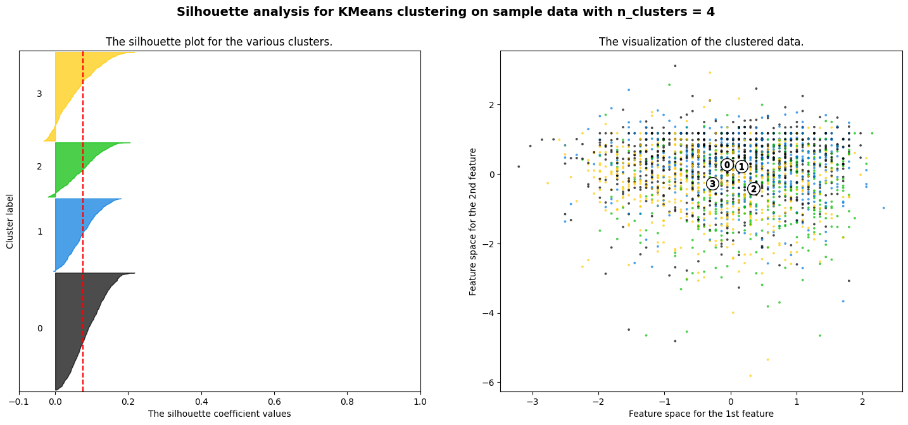
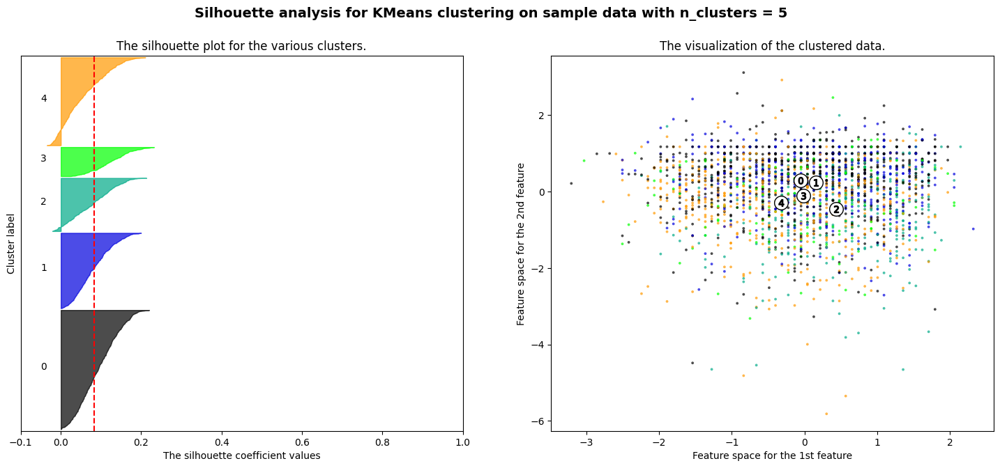
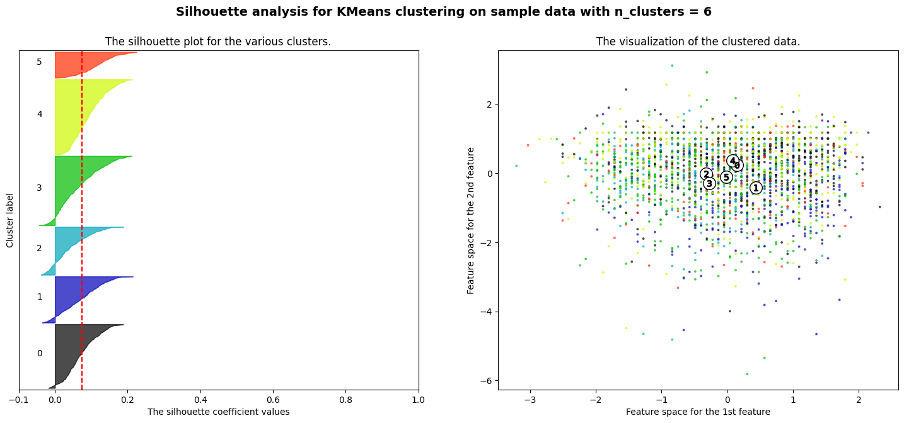
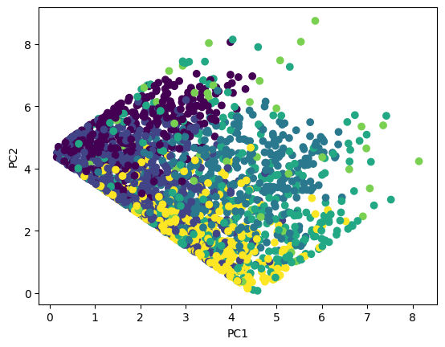
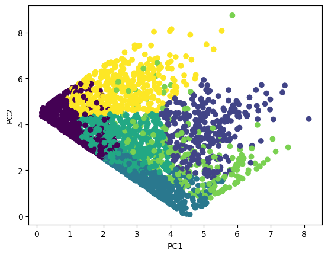

[Back to Project Page](https://kdfullington.github.io/kdfullington_portfolio/projects/)

[Visit the Repository for This Project](https://github.com/kdfullington/kdfullington-portfolio/tree/main/kmeans_health_data)

For this project I performed Kmeans Clustering to categorize anonymized individuals using their health data.

I used the elbow method to determine the optimal number of K values.

I performed a silhouette analysis for several different numbers of clusters.

2 Clusters

3 Clusters

4 Clusters

5 Clusters

6 Clusters

I also made a scatterplot of the PCA transformed data, coloring each point by its cluster value. You can see that the second (PCA transformed) graph is much more orthogonal, meaning that the clusters are more distinct from each other.

