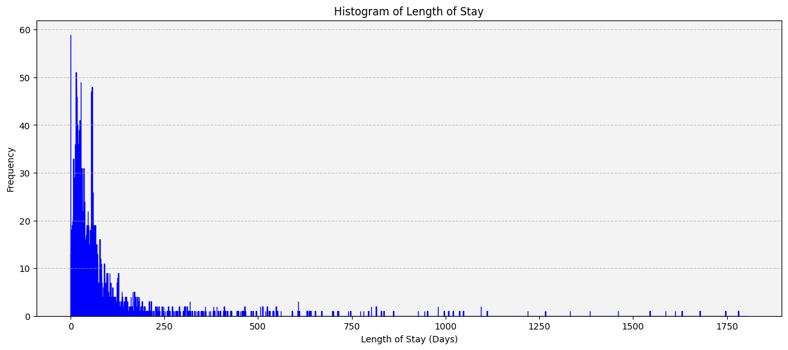

[Back to Project Page](https://kdfullington.github.io/kdfullington_portfolio/projects/)

[Visit the Repository for This Project](https://github.com/kdfullington/kdfullington-portfolio/tree/main/muddy_paws)

**Business Problem**
The president of Muddy Paws Second Chance Rescue has asked me if I can predict the amount 
of time an animal may stay in their foster organization. She also wants to know what 
characteristics most influence length of stay. 

**Background**
Muddy Paws Second Chance Rescue is a all-breed rescue organization located in the Omaha, NE 
area. According to their website, they provide the following services: - 
Provide foster homes and medical care to animals in need - - - - 
Offer education and training to resolve behavioral issues so owners can keep their pets 
Help owners rehome their animals through social media 
Assist qualified owners with veterinary expenses 
Maintain a pet food pantry for owners who need help feeding their pets 
They primarily care for cats and dogs, but also take a variety of other animals such as guinea 
pigs, birds, and farm animals (dependent upon foster availability). They are a primarily 
volunteer-based organization. They have a thorough application process for both adopters and 
fosters, which is designed to assure that pets are rehomed in a stable and loving new home. They 
maintain their data in a database called Petstablished, which is where I will be accessing the 
required data. 

**Data Explanation**
I will be drawing from two main data sets: one for general animal characteristics and one for 
medical records. They are connected by the animal’s petstablished ID. They have a variety of 
attributes that can be selected for export. I chose to remove any personal information (such as 
foster address and phone number) for the sake of maintaining volunteer and adopter privacy. I 
am listing the attributes I selected below. I will include example entries as well. 

**Methods**

**Data Cleaning**
Cleaning was an iterative process that did not happen just once. My first steps involved cleaning 
the format of the data to be easier to work with (replacing spaces with underscores, transforming 
all data in the data frame to be lowercase, removing special characters, etc.). I also created new 
columns of augmentation data (such as for Courtesy Posts and Cross Posts), and used the 
Temperament column to create a sentiment score for the animal. I do not believe there was quite 
enough data to make that sentiment score very valuable, but I hope that when more data becomes 
available that it will help much more. I also ensured that the categories in the categorical 
columns were standardized. For example, Gets Along with Kids and Special Need contained one 
of three values: No, yes, and not sure. I also cleaned up the age column (which contained entries 
such as 1 year, 6 months). I calculated the ages in months and created a new column for age in 
months, which is important to keep in my analysis.

**Exploratory Data Analysis**
When exploring the data, I primarily focused on length of stay. I wanted to know what the 
distribution of lengths was, so I created a histogram for length of stay. I saw that the data are 
very right-skewed, which is important to know for analysis. See the image below. It is possible 
that accuracy would be helped by attempting to normalize the data. 

**Data Preparation**
I expected that I would try both random forest classification and decision tree classification. I avoided linear regression because even though length of stay in days is continuous, there are not enough data points to gain useful insights from this type of model. 
To use classification models, I needed categories. I initially attempted to develop my own categories as ranges. For example, I tried categorizing in collections of 50 days each. After testing a few ranges, I decided to use K Means clustering to determine what ranges would be appropriate.
Lastly, I created dummy variables for every categorical variable that I selected for analysis. This created more columns where the entry was either 0 (for no) or 1 (for yes).

**Analysis**
After determining ranges with K Means, I tested out several numbers of clusters in the random forest classifier model I created. See below for the numbers of clusters I tried and their corresponding model accuracies.

| Number of Clusters | Accuracy |
| ------------------ | -------- |
| 8                  | 33%      |
| 9                  | 63%      |
| 10                 | 64%      |
| 15                 | 46%      |
| 20                 | 33%      |

For the highest accuracy model, here is the classification report I printed out. 

|          | Precision | Recall | F1-Score | Support |
|----------|-----------|--------|----------|---------|
| 0-19     | 0.63      | 0.94   | 0.76     | 143     |
| 1025-1612| 0.00      | 0.00   | 0.00     | 1       |
| 103-166  | 0.00      | 0.00   | 0.00     | 12      |
| 167-277  | 0.00      | 0.00   | 0.00     | 3       |
| 20-56    | 0.69      | 0.48   | 0.57     | 79      |
| 278-411  | 0.00      | 0.00   | 0.00     | 3       |
| 412-567  | 0.00      | 0.00   | 0.00     | 5       |
| 568-774  | 1.00      | 1.00   | 1.00     | 1       |
| 57-102   | 0.50      | 0.08   | 0.13     | 26      |
| Accuracy |           |        | 0.64     | 273     |
| Macro avg| 0.31      | 0.28   | 0.27     | 273     |
| Weighted avg | 0.58  | 0.64   | 0.58     | 273     |

The highest accuracies for each category were those that had the most samples per category. More data will likely improve the accuracies for those that have few samples. The model was fair at predicting stays under 102 days. 

| Feature                           | Importance      |
|-----------------------------------|------------------|
| Age_total_months                  | 0.081462         |
| Gender_male                       | 0.018870         |
| Gender_female                     | 0.018104         |
| Litter_no                         | 0.016156         |
| Litter_yes                        | 0.015563         |
| Size_medium                       | 0.015507         |
| Special_need_not_sure             | 0.015176         |
| Housebroken_no                    | 0.015060         |
| Size_large                        | 0.014847         |
| Gets_along_with_cats_not sure     | 0.014789         |

**Conclusion**
Overall, there were some important discoveries. The ranges of days may need to be adjusted to increase accuracy. The model also needs more feature engineering. For instance, we likely do not need both “litter_yes” and “litter_no”, as they are mutually exclusive. 
More work will need to be done prior to presenting to the president, but this is a pretty good start.

**Assumptions**
For the purposes of analysis and modeling, I assumed that the data entered in Petstablished was accurate to the best of the data entry person’s ability. I also elected to focus only on dogs to simplify the analysis. I also selected only dogs that were in the status of adopted, and assumed that they were not returned at any points.

**Limitations**
The starting data set was limited to roughly 3000 rows for dogs, so the sample size I used for this analysis was relatively small. The rescue is a local organization and they have only been running for a handful of years. I selected the data from their founding all the way until November 30th, 2023. Thus, some dogs that are still in foster care were eliminated from the analysis because they have not been adopted at the cut off for the data set.

**Challenges**
Cleaning the data for this project was challenging. The Pet Name column gave me trouble, because it contained valuable information that was not otherwise captured in an inconsistent format. For example, a Courtesy Post (within the organization’s context) is an adoption listing where the dog is still in the original owner’s home. There are also Cross Posts (listings where the dog is in the care of another organization). However, there are no separate columns for these crucial distinctions. Instead, they listed them in the Pet Name column. For example: “Abbey (Cross Post)” So, when cleaning the data, I had to use the Pet Name column to create new columns for Cross Posts and Courtesy Posts. 
Further challenges arose when testing different types of models on the data set. Most of the models had relatively low performance and required a lot of feature engineering and other methods to increase the accuracy without overfitting.

**Future Uses and Additional Applications**
In the future, the work done in this project could be used as the basis for work with additional local organizations and not just Muddy Paws. I also would like to expand the model to include the impact of social media promotion eventually, though that may be best with much more data than a single organization can provide. 

**Recommendations**
I would highly recommend that Muddy Paws (and other local organizations) develop a standardized operating procedure for data entry. I have feedback for them on this topic. For instance, could they add columns for Cross Posts and Courtesy Posts so the data scientist does not have to add columns during cleaning. Furthermore, the Temperament column (and other free text fields) could have entries selected from a pre-defined list of traits. For example, “reactive”, “previous bite”, “sweet”, “shy” would all be good words for sentiment analysis. I would also encourage their data entry people to fill in as much of the information as they possibly can for each pet. I assigned a sentiment score for the data that was available in the temperament column. However, since there were so many blanks, I do not know that the sentiment score was that helpful in the long run. 
I would also recommend that the local organizations expand their work together to include data management and analysis. They often move difficult animals to other organizations who may be better-suited and/or have more resources at the current time. Increasing the data available for analysis will lead to increased model accuracy and more predictable animal outcomes.

**Ethical Assessment**
The president wants these predictions to help her determine where to spend resources such as money and foster homes. The nature of rescue organizations means that their animals are often homeless and/or in need of expensive medical care. My concern is that the model could be used to deny care to animals who may otherwise have received it through the rescue. Inaccurate predictions could also lead to heartbreak. Animals that are identified as long stayers may be passed over when in fact they may have been quickly adopted. 
I do not believe the president will use the model in this way, but it is a risk to consider. 

