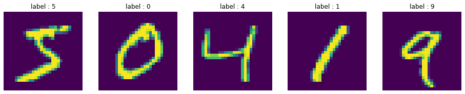

[Back to Project Page](https://kdfullington.github.io/kdfullington_portfolio/projects/)

[Visit the Repository for This Project](https://github.com/kdfullington/kdfullington-portfolio/tree/main/number_image_classification)

I used a Keras CNN classifier on a data set of handwritten numbers. Here is a sample of the data:

Below is the confusion matrix. The diagonal from upper left to lower right has high numbers, which is exactly what we want. For example, the upper left number 975 reflects that "0" was predicted correctly as "0" 975 times.

|     | 0   | 1   | 2   | 3   | 4   | 5   | 6   | 7   | 8   | 9   |
|-----|-----|-----|-----|-----|-----|-----|-----|-----|-----|-----|
| 0   | 975 | 0   | 1   | 0   | 0   | 0   | 3   | 1   | 0   | 0   |
| 1   | 0   | 1128| 3   | 0   | 0   | 0   | 1   | 2   | 1   | 0   |
| 2   | 1   | 0   | 1018| 0   | 1   | 0   | 2   | 9   | 1   | 0   |
| 3   | 0   | 0   | 2   | 984 | 0   | 6   | 0   | 10  | 1   | 7   |
| 4   | 0   | 0   | 2   | 0   | 967 | 0   | 2   | 2   | 1   | 8   |
| 5   | 0   | 0   | 1   | 6   | 0   | 882 | 2   | 0   | 1   | 0   |
| 6   | 3   | 2   | 1   | 1   | 4   | 2   | 945 | 0   | 0   | 0   |
| 7   | 1   | 2   | 7   | 0   | 0   | 0   | 0   | 1015| 2   | 1   |
| 8   | 3   | 0   | 4   | 5   | 1   | 1   | 2   | 4   | 948 | 6   |
| 9   | 2   | 0   | 1   | 2   | 5   | 6   | 0   | 4   | 3   | 986 |