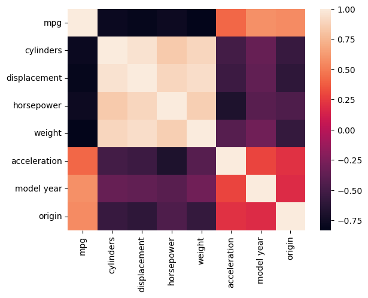
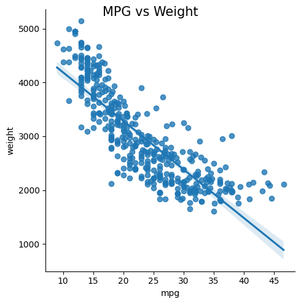

[Back to Project Page](https://kdfullington.github.io/kdfullington_portfolio/projects/)

[Visit the Repository for This Project](https://github.com/kdfullington/kdfullington-portfolio/tree/main/predicting_mpg)

For this project I used a set of data that contained statistics for various types of vehicles. Among other things, I calculated the correlations between the variables. This is visualized below in a heatmap.

Checking specifically into the correlation between miles per gallong (mpg) and weight, we can see that it has a strong negative correlation. The line of best fit has roughly a -0.83 slope and the dots cluster fairly closely.

For more details see the repository linked above.