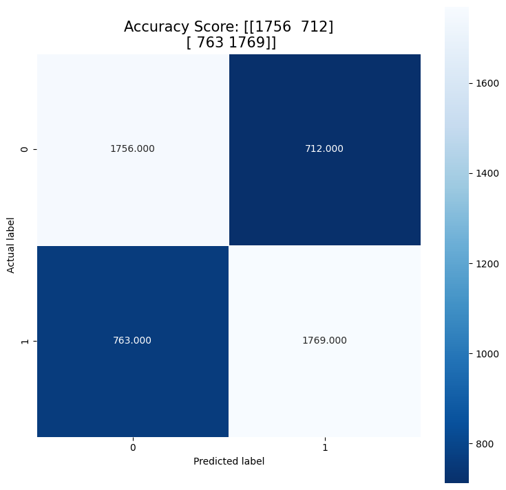

[Back to Project Page](https://kdfullington.github.io/kdfullington_portfolio/projects/)

[Visit the Repository for This Project](https://github.com/kdfullington/kdfullington-portfolio/tree/main/text_analysis_movie_reviews)

The purpose of this project was to predict a label (postive or negative) to the text of movie reviews. Various transformations were applied to the text to make it friendly for modeling. Below we have a heatmap that shows the number of correctly predicted labels versus the number of incorrectly predicted labels. The diagonal (upper left to lower right) shows higher numbers, which means the model performed well. For more details, see the repository linked above.

